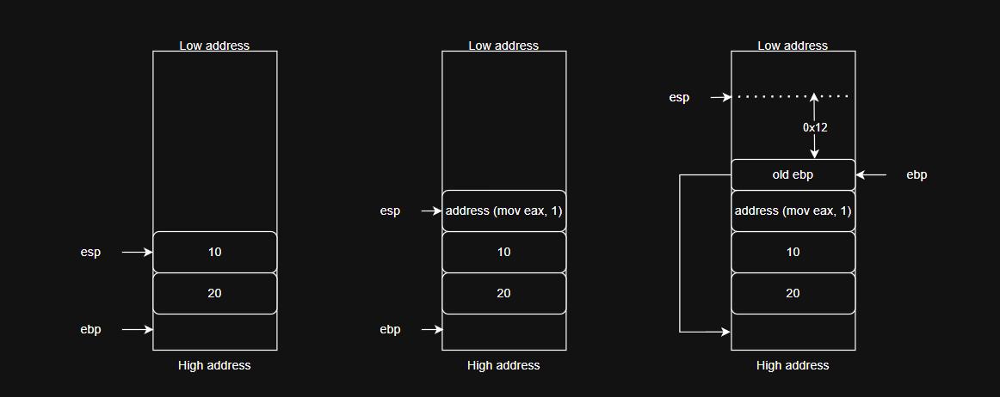
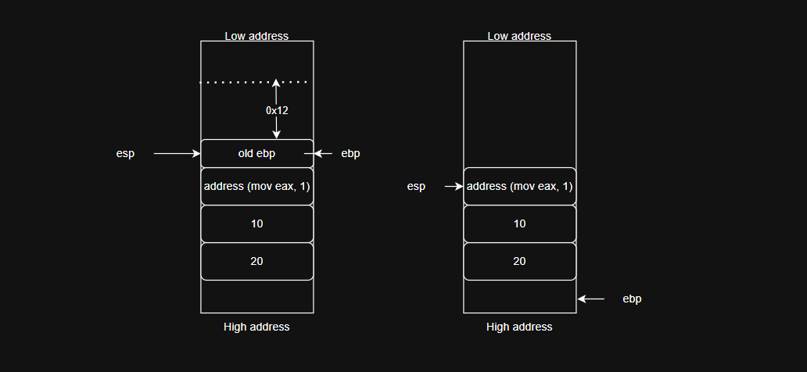

This is the first post on my zero-to-hero journey into Windows exploitation. It introduces registers, the stack, calling conventions, and how to use WinDbg to debug a program on Windows.

### Registers
On 32-bit (x86) Windows, there are 9 commonly used registers: EAX, EBX, ECX, EDX, ESI, EDI, ESP, EBP, and EIP. The function of each register is listed in the table below.

A 32-bit register starts with the prefix 'e' (e.g., EAX). Its lower 16 bits are called AX; within AX, the high byte is AH and the low byte is AL. The same applies to the other registers.

|Register|Function|
|:--------:|:--------:|
|eax (accumulator)     |arithmetic and logic instructions|
|ebx (base)|base pointer for memory addressing|
|ecx (counter)|counter for loops, shifts, rotations|
|edx (data)|I/O port addressing, mul, div|
|esi (source index)|pointer to the source data in string copy operations (movsd)|
|edi (destination index)|pointer to the destination data in string copy operations (movsd)|
|esp (stack pointer)|always points to the top of the stack|
|ebp (base pointer)|saves ESP when a function is called; used to access stack data via an offset (ebp + offset)|
|eip (instruction pointer)|points to the next instruction to be executed; an attacker's target when exploiting memory corruption (e.g., a buffer overflow)|


### Stack
A thread running code from an image (EXE) or a DLL needs a data region for function calls, local variables, and so on. Each thread has its own stack so it can run independently. The stack is LIFO: data is pushed onto the top and popped from the top.
```text
        Higher addresses
        +---------------------+
        |     Function args   |
        +---------------------+
        |   Return Address    | ← EIP
        +---------------------+
        |     Saved EBP       | ← EBP
        +---------------------+
        |   Local variables   |
        +---------------------+
        |       Buffer        |
        +---------------------+ ← ESP
        Lower addresses
```
### Prolog and Epilog
The prolog and epilog are the code snippets at the beginning and end of a function in assembly.

`Prolog` (start of function) is the code at the beginning of the function, responsible for setting up the function's stack frame:
- Save the old EBP (push ebp)
- Set up the new stack frame (mov ebp, esp)
- Allocate stack space for local variables (sub esp, N)
- Save the registers that need to be preserved (push reg)

`Epilog` (end of function) is the code at the end of the function, responsible for cleaning up the stack before returning:
- Restore the saved registers (pop reg)
- Release the stack frame (mov esp, ebp / pop ebp)
- Return with ret (jumps to the address on top of the stack)

Example in x86:
```c
int add(int a, int b);

// in the caller:
add(10, 20);
```

```asm
push 20          ; b (arguments are pushed in reverse order)
push 10          ; a
call add
mov ebx, eax     ; the address of this instruction is pushed by `call` as the return address

add:
    push ebp
    mov ebp, esp
    sub esp, 0x12    ; allocate space for local variables

    ; ... function body ...

    mov esp, ebp
    pop ebp
    ret
```
Prolog of the add function, mapped in the debugger:

- First, the function's arguments are pushed onto the stack (in reverse order).
- Next, `call` pushes the address of the instruction right after it onto the stack — this is the return address that `ret` will use.
- The old EBP is stored on the stack, ESP is copied into EBP, and space for local variables is allocated via `sub esp, 0x12`.

Epilog of the add function, mapped in the debugger:

- ESP is restored via `mov esp, ebp`.
- `pop ebp` restores EBP to its previous value.
- Finally, the stack is cleaned up according to the calling convention (covered in the next section). `ret` then jumps back to the instruction after `call add`.

### Calling conventions
Windows has many calling conventions, which define how the caller and the callee communicate with each other. Some of them are __cdecl, __stdcall, __fastcall, __thiscall, and __vectorcall.

*1. __cdecl*

__cdecl is the default calling convention for C programs on x86.
Example:
```c
int __cdecl add(int a, int b) {
    return a + b;
}
```
The caller cleans up the stack. For example:
```c
add(10, 20);
```
The assembly looks like this:
```asm
push 20
push 10
call add
add esp, 8
```
Inside the function:
```asm
add:
    push ebp
    mov ebp, esp
    mov eax, [ebp + 8]      ;a
    add eax, [ebp + 12]     ;b
    
    pop ebp
    ret
```
After the function returns, the caller executes `add esp, 8` to restore the stack — this is why __cdecl is said to use *caller cleanup*.

*2. __stdcall*

32-bit Windows uses this convention for most of its APIs. Example C code:
```c
int __stdcall add(int a, int b);
```
Assembly code:
```asm
push 20
push 10
call add
```
The caller doesn't clean the stack here, because the callee does it. 
```asm
add:
    push ebp
    mov ebp, esp

    mov eax, [ebp + 8]
    add eax, [ebp + 12]

    pop ebp     
    ret 8       ;return and clear stack
```
The callee uses `ret 8`, which behaves like `add esp, 8` followed by `ret`.

*3. __fastcall*

__fastcall passes the first and second arguments in ECX and EDX. Example:
```c
int __fastcall add(int a, int b, int c);
```
The assembly moves arguments a and b into ECX and EDX, like this:
```asm
mov ecx, 10     ;a
mov edx, 20     ;b
push 30         ;c
call add
```

*4. __thiscall*

__thiscall is especially important in C++: when an object calls one of its methods, the `this` pointer has to be passed to the callee, and __thiscall handles this. Example:
```c++
class Calculator {
public:
    int add(int a, int b);
};
```
And when an object calls add:
```c++
Calculator obj;
obj.add(10, 20);
```
In MSVC x86, `this` is typically passed in ECX. The assembly looks like this:
```asm
mov ecx, address_obj
push 20
push 10
call Calculator::add
```

*5. __vectorcall*

It is designed to pass vector/SIMD data more effectively. Example:
```c++
__m128 add(__m128 a, __m128 b);
```
With __vectorcall, the compiler can make the most of the XMM/YMM registers to pass vector arguments.

*Summary of calling conventions*
|Convention|Arguments|Stack cleanup|
|------------|-----------------------------------|-------------|
| `cdecl`      | stack                               | caller        |
| `stdcall`    | stack                               | callee        |
| `fastcall`   | ECX/EDX + stack                     | callee        |
| `thiscall`   | `this` in ECX + stack            | usually the callee |
| `vectorcall` | registers for vector/scalar | per the ABI      |


### WinDbg

| Situation | WinDbg Command / Step |
|---|---|
| Attach the debugger to a process | File → Attach to a Process… (F6) → select Notepad → OK |
| Continue running the app after attaching / after a breakpoint | `g` |
| Reload symbols from the Microsoft symbol server | `.reload /f` |
| Troubleshoot symbols that fail to load | `!sym noisy`, then repeat the command that triggers symbol loading; check `.sympath` |
| Disassemble code/function | `u kernel32!GetCurrentThread` (without an argument = start from EIP) |
| Read memory by size | `db esp` (byte) · `dw esp` (WORD) · `dd esp` (DWORD) · `dq 00faf974` (QWORD) |
| Display memory with ASCII | `dc KERNELBASE` (DWORD+ASCII) · `dW KERNELBASE+0x40` (WORD+ASCII) |
| Read a string | `da <addr>` (ASCII) · `du edi` (Unicode) |
| Limit the number of elements displayed | `dd esp L4` — L is counted in units of the format (default: 0x80 bytes) |
| Dereference a pointer | `dd poi(esp)` |
| Dump a structure | `dt ntdll!_TEB` · recursive: `dt -r ntdll!_TEB @$teb` · single field: `dt ntdll!_TEB @$teb ThreadLocalStoragePointer` |
| Get the size of a structure | `?? sizeof(ntdll!_TEB)` → `0x1000` |
| Modify memory | `ed esp 41414141` (DWORD) · `ea esp "Hello"` (ASCII) · `eu` (Unicode) |
| Search for a pattern throughout user memory | `s -d 0 L?80000000 41414141` (DWORD) · `s -a 0 L?80000000 "string"` (ASCII) · `s -u 0x0 L?80000000 w00tw00t` (Unicode) |
| View registers | `r` (all registers) · `r ecx` (a single register) |
| Modify a register | `r ecx=41414141` |
| Set a software breakpoint | `bp kernel32!WriteFile` (replaces the opcode with INT 3; no limit on the number of breakpoints) |
| Manage breakpoints | `bl` (list) · `bd 0` (disable) · `be 0` (enable) · `bc 0` / `bc *` (delete one / delete all) |
| Set a breakpoint in a module that has not yet been loaded | `bu ole32!WriteStringStream` (automatically resolves when the module loads; check the module with `lm m ole32`) |
| Automatically execute commands when a breakpoint is hit | `bp kernel32!WriteFile ".printf \"The number of bytes written is: %p\", poi(esp + 0x0C);.echo;g"` |
| Conditional breakpoint | `bp kernel32!WriteFile ".if (poi(esp + 0x0C) != 4) {gc} .else {.printf \"The number of bytes written is 4\";.echo;}"` |
| Continue from a conditional breakpoint | `gc` |
| Set a hardware breakpoint | `ba e 1 kernel32!WriteFile` (execute) · `ba w 2 03b2c768` (write 2 bytes) — e/r/w + size + address; maximum of 4 |
| Step through instructions | `p` (step over) · `t` (step into) |
| Run to the end of a function / to a branch | `pt` (to `ret`) · `ph` (to a branch instruction) |
| List modules | `lm` · filter: `lm m kernel*` |
| Find symbols by partial name | `x kernelbase!CreateProc*` |
| Perform calculations (hexadecimal input by default) | `? 77269bc0 - 77231430` · `? 77269bc0 >> 18` |
| Enter decimal/binary values | `? 0n41414141` (decimal) · `? 0y1110100110111` (binary) |
| Display all formats at once | `.formats 41414141` (Hex/Decimal/Octal/Binary/Chars/Time/Float/Double) |
| Temporary variables (pseudo-registers) | `r @$t0 = (41414141 - 414141) * 0n10` then `? @$t0 >> 8` — `$t0`–`$t19`; `@` should be used |
| Look up documentation directly in WinDbg | `.hh` |

**Key figures to remember:** Windows user-mode memory `0x00000000–0x7FFFFFFF` · 9 32-bit registers · `__stdcall` arguments are pushed in reverse order (right → left), 4 bytes per argument → the nth argument is at `esp + 4*n` · maximum of 4 hardware breakpoints (debug registers) · `L?80000000` = the entire user-mode memory range · 20 pseudo-registers `$t0–$t19` · `_TEB` = `0x1000` bytes.
